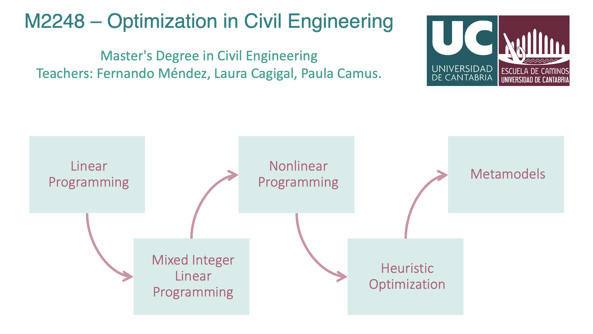

[](https://mybinder.org/v2/gl/geoocean%2Fcourses%2Foptimization/main)

# M2248 - Optimization in Civil Engineering

Fernando J. Méndez Incera (fernando.mendez@unican.es)\
Laura Cagigal Gil (laura.cagigal@unican.es)\
Paula Camus (paula.camus@unican.es)

<a name="sum"></a>
## Summary



<a name="book"></a>
## Jupyter Book
The Jupyter Book with all the material can be accessed [here](https://geoocean.gitlab.io/courses/optimization/book/intro.html)


<a name="ins"></a>
## Install


<a name="ins_src"></a>
### Create an environment in conda
To run the toolbox, you need to set up a conda enviroment with the required Python packages.

1. From the Start menu, click the Anaconda Navigator desktop app
2. On Navigator’s Home tab, in the Environments panel on the left, click over the play button on the `base` enviroment and launch the Anaconda Prompt
3. By using the `cd` command, navigate to the `optimization` folder where it is contained this repository and execute: 

```
# Default install, miss some dependencies and functionality
conda env create -f environment.yml 
```

### Activate conda environment
Activate the environment:

```
conda activate optimization
```

To remove an environment, in your terminal window or an Anaconda Prompt, run:
```
conda remove --name optimization --all
```

### Launch Jupyter Notebook
```
jupyter lab
```